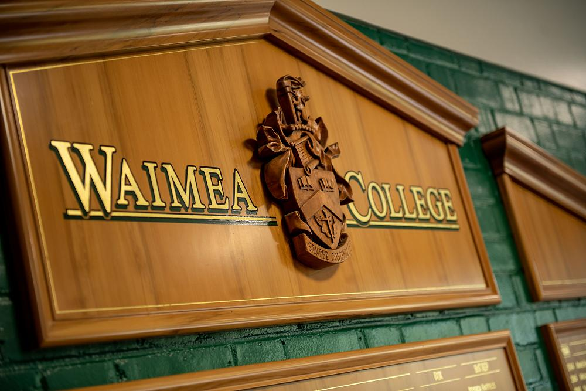

# Library Mystery Room

This is my Level 3 NCEA project for Digital Technologies

It is a database-driven web app that allows users to:

- Answer multiple questions themed on a certain section within the library
- An Admin permission to create more sections and questions to go with
- A dynamic map for users to see change as they go through the levels and is customizable by admin

## Documentation

The following documents support this project:

- [Design & Review](docs/Design.md)
- [Development & Testing](docs/Development.md)

