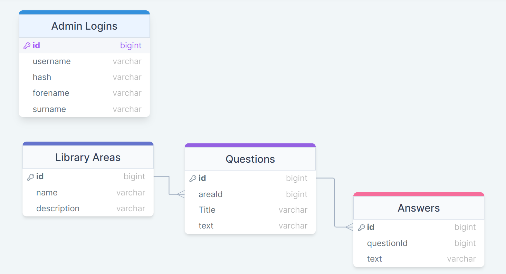
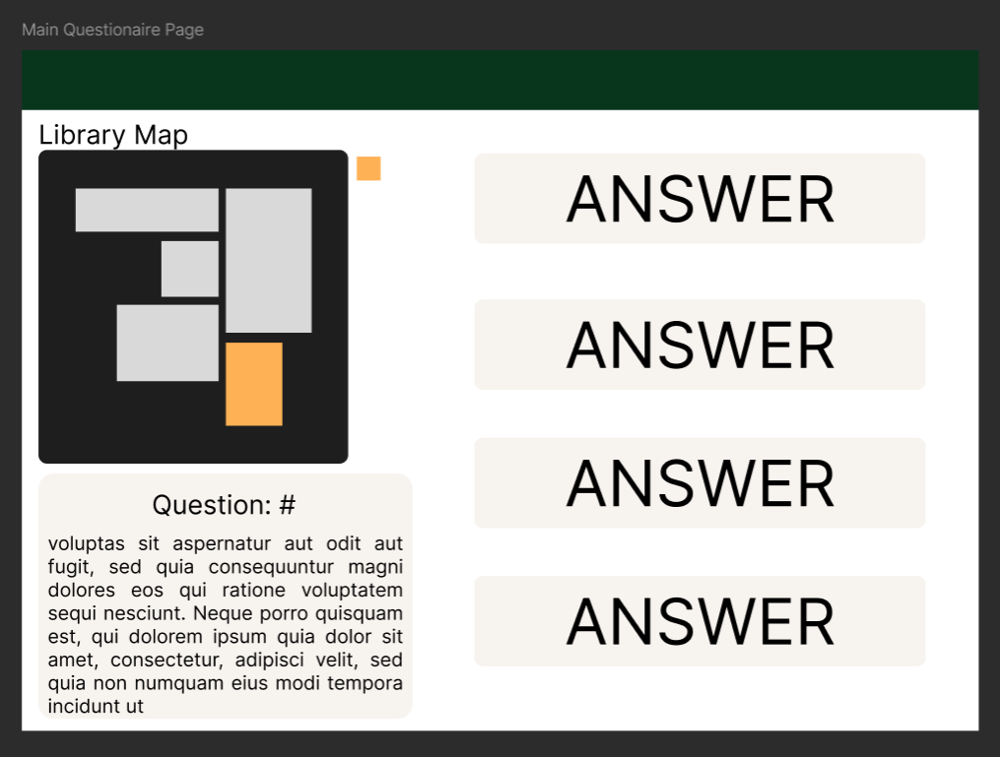
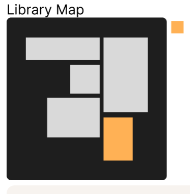
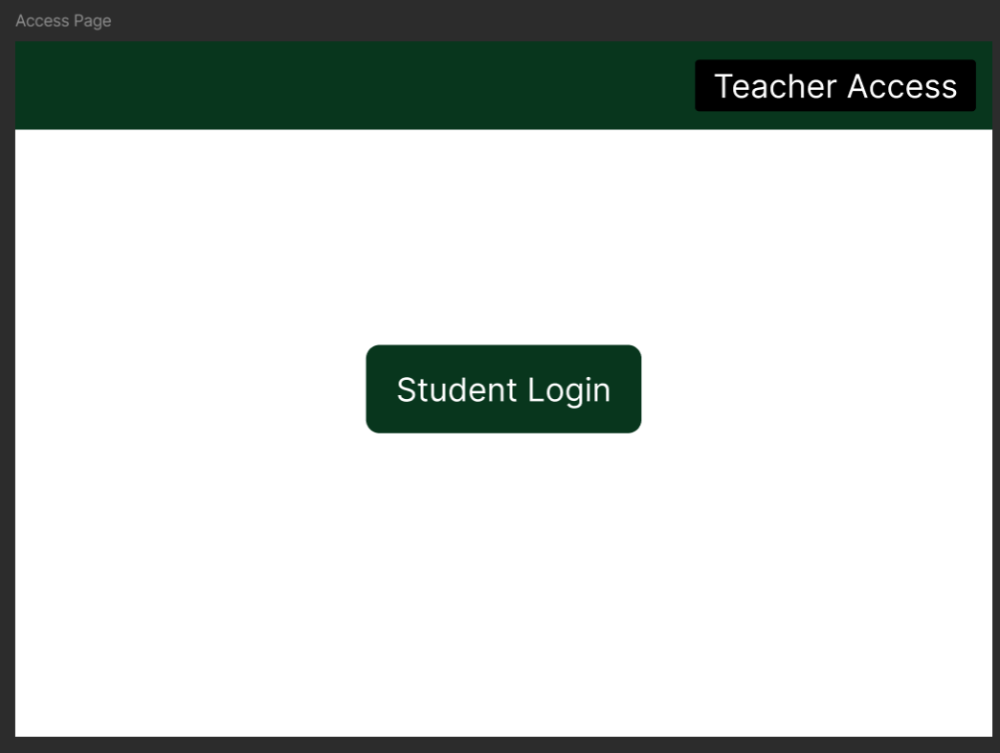
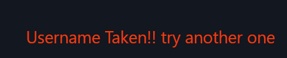

# Design of a Database-Driven Web Application for NCEA Level 3

Project Name: **Library Mystery Room**

Project Author: **Josiah Ching**

Assessment Standards: **91902** and **91903**

-------------------------------------------------

## System Requirements

### Identified Need or Problem

Miss Chapman the school librarian ad business studies teacher needs an introductory for library rules that is fun and engaging to  year 9 students.

### End-User Requirements

The end users are year 9 students aged 13-14 so they will be expecting a page that runs without constant load times and is engaging as well as well thought out questions to really drive home the lessons and rules that will be learned.

### Proposed Solution

I intend to make a web-site that year 9 students will go onto when directed by the librarian on there introductory of the library and will be a fun trivia/mystery room style game that will teach the library house rules by asking questions about a specific area within the library and rewarding correct answers and penalising on incorrect answers to encourage a competitive or "gamey" feel. The key functionality will be creating a learning environment within the web-site that can be manipulated by Miss Chapman or a teacher by using an admin login and really focusing the questions to the current room/section they are currently in.

-------------------------------------------------

## Relevant Implications

### Aesthetic

Aesthetic implication is whether the website or app looks appealing to the end user and has design elements that are easy to follow and have meaning.

This implication is relevant to my project because the app/website will be showed and used by teachers and students alike so it needs to look clean and sharp so that they are able to follow the questions and story path or the website, as well as being attractive to eye to further engage students.

Moving froward with my project i will be making sure to build good platforms and layout all the information presented to the user in a way that i can style to be as easy to digest as possible for the users and having that good layout will majorly improve that. I will also need to consider the color scheme that will be suited best for this project and how to implement it as a go through development. This project will be heavily impacted by the aesthetic implication as it will be the main way of drawing the young students attention.

### Functionality

The functionality implication is where the website/app is working to how it should or is expected to and works very well with minimal bugs and glitches.

Functionality is relevant because of my mystery room/game style of website it is very important that it works as intended so end users dont run into bugs or weird glitches that will ruin the experience of the website as well as end users not being let down the wrong path of the game due to a bug or error and confusing them.

When moving forward i will be making sure to test for bugs. I will also have to consider how the end users might interact with the website so i can plan and code the features accordingly for that. Also when moving forward i will implement my features such as admin login for Miss Chapman or any other teacher that uses it, setting up the rooms and the questions that go with that room making sure i think about my other relevant implications Aesthetics and Accessibility making a functioning experience. This implication will have a big impact because the website will need to function how the end-users expect and be bug free for them as well.

### Accessibility

Accessibility is all people can use it regardless of device or medical problem such as color blindness or impaired vision.

This implication is relevant because a range of young people all on different devices will be logging on and using this website. Some users may even have impaired vision or color blindness. So creating a website that is accessible by everyone is very important for this project.

The project wil be impacted by this implication cause allowing every and any student no matter what device or impaired ability is very important cause this is a learning tool made for them. So moving forward in my project especially within the front-end so making the UI such as headings nav menus button scale and position them selves accordingly with screen size and space. Another thing is the positioning of sections or chunks of UI making sure to code them in places that make sense and will allow them to be flexible with screen size differences.

-------------------------------------------------

## Relevant User Experience (UX) Principles

### Visibility of System Status

Showing the users what is happening during loading screens or showing progress of some sort action as well as informing users with messages alerting them to what is going on.

Showing the users there status as there going through the levels and different rooms is very important so they can expect when to finish that section and move onto the next and have a sense of where they are and where they are going, also making sure to give feedback when they provide input whether its lighting up the button or showing some sort of message.

I will make sure to consider what the user will expect when a button is clicked or what is showed when there answer is correct and what information they expect to see. The Visibility of System Status will be very important for this project as it will be the window for users to get the information they need and expect.

### Error Prevention

Error prevention is stopping the user before a big commitment or change and asking for confirmation that this is the action they wanna take this used to stop unintentional mistakes and errors on the users end.

Error prevention will be a big part of making sure that answers they select and decisions that are user made are the intended actions of the user.

Big thing moving forward will be getting users that fit the intended end user to test these error prevention features to mke sure that users are not getting asked for confirmation for things that do not need to be as well as stakeholder feedback big confirmations to see if they are necessary. I will also be making sure to thoroughly test for loop holes in the game, to make sure users cant run them selves into glitches and bugs

### Aesthetic and Minimalist Design

Keeping the UI simple and easy to follow. Use minimalist features to eliminate crowding on the page and only show necessary information.

When presenting the necessary information such as question number which level/area as well as minimap and the question at hand and answers to my users it will have to be presented in a minimalist way to stop cluttering and confusion and actually get this information to the user effectively.

Moving froward this will go hand and hand with my aesthetic relevant implication in making sure i really think from my users position and get feedback from my stakeholder with new designs and placement of information to make sure tht the changes i make are actually the right changes for the end users.

-------------------------------------------------

## Final System Design

### Database Structure

### User Interface Design

-------------------------------------------------

## Completed System

### Database Structure

### User Interface Design

https://mywaimeaschool-my.sharepoint.com/:v:/g/personal/jching_waimea_school_nz/ETrtugIkMkJJv04-dsTDmaYBBK6ziQCrmiAvmbqo63MJoQ?nav=eyJyZWZlcnJhbEluZm8iOnsicmVmZXJyYWxBcHAiOiJTdHJlYW1XZWJBcHAiLCJyZWZlcnJhbFZpZXciOiJTaGFyZURpYWxvZy1MaW5rIiwicmVmZXJyYWxBcHBQbGF0Zm9ybSI6IldlYiIsInJlZmVycmFsTW9kZSI6InZpZXcifX0%3D&e=xp7zhj

-------------------------------------------------

## Review and Evaluation

### Meeting the Needs of the Users

THe end product meets the users requirements because the page has a mixture of php routing and HTMX to make certain parts of the page efficient and fast without having to refresh the page giving instant feedback and results to suit the need of a reactive and engaging quick page to keep up with the end users expectations. THe end users this page was intended for where the year 9's in the age range 13-14 years old.

### Meeting the System Requirements

The requirements and list of features was creating a "gamey" feel with penalising on incorrect answers and encouraging a competitive learning environment that can all be manipulated by an admin with an array of admin tools and separating questions into there respective areas of the library. My system has implemented these key features well by having the questions penalise the user and give strict warning when the incorrect answer is selected as well as create admin tools that can be used very extensively to shape the questions that are presented to the users.

### Review of Aesthetics

For the relevant implication of aesthetics i made sure to use a very simple clean and tidy color scheme
for the most of the web site to help it come across as neat as possible and easy to follow and interpret the majority of the buttons are a cool shade of blue and if i ever needed to draw attention to a certain button or important feature i used a more vibrant highlight color of red to draw the users attention to that area.

### Review of Functionality

for functionality i have been through lots of development and bug fixing so i have lots of little snippets of code which help to create a bug free experience and also help with the security of the admin privileges such as not being able to type the route for the admin creation page into the URL to skip over to te page it is hard coded into the website to not allow users onto the creation page with out the key which i and admins only have.

### Review of Accessibility

I used a color scheme that is easy on the eyes and allows text and links to stand out allowing for good navigation and accessibility of the website. There eis also alt text for the images in the case of a bad connection or there is trouble loading the images from the database or server. Text is also in a clear font and a contrasting colour to the background to aid in color blindness and dyslexia.

### Review of Visibility of System Status

to show system status i make sure to show status messages so that users know what has happened with there input and that they know what they are needed to do to make a complete action. Like in this case i have added a message to display when the wrong answer has been selected or when you have entered wrong details into a form that cant or wont be processed well by the server.

### Review of Error Prevention

For error prevention there is plenty of warnings and errors that i have coded in so that users cant make mistakes that will effect the whole website and there experience of the website, such as an error for when you have put in the wrong password or username or when you are making an account and you have entered a username that already exists.

### Review of Aesthetic and Minimalist Design

To keep a minimalist design and have less clutter within the page i have through out my web-page made sure to only show information to the user that is necessary and keep that information in tidy fonts and headings depending on the urgency of the information or how important it is, as well as keep a simple font and font size for ease of reading and a nice color scheme to further tidy the information presented to the user.

For the questions page i have made the question number and question title headings so that they stand out to the user but made sure to keep the rest of the information valid and in good view of the user.