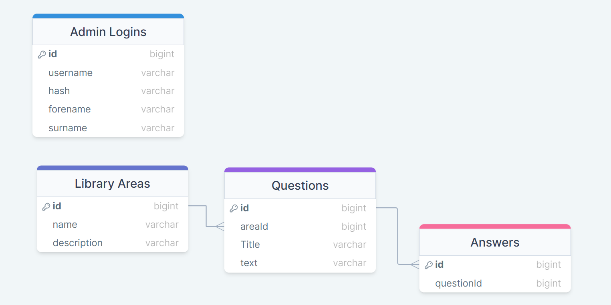
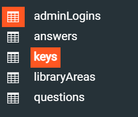

# Development of a Database-Driven Web Application for NCEA Level 3

Project Name: **Library Mystery Room**

Project Author: **Josiah Ching**

Assessment Standards: **91902** and **91903**

-------------------------------------------------

## Design, Development and Testing Log

### 21/06/2024

I am working on a rough sketch up of the main questionnaire page on Figma.

i just did a rough mark up to show the layout of the library map, question text and answer buttons. Will be subject to change as i move forward.

This is how i plan to show what library section the question is themed to, by segregating the library into sections and highlighting the current section that the questions are focused around.

> Replace this text with any user feedback / comments

Replace this text with notes describing how you acted upon the user feedback: made changes to design, etc.

### 25/06/24

Simple access/home page for students and admins.

This is a very simple design just 3 squares and 2 lots of text but the only purpose of this page is for the teacher/admin to be able to gain access to the admin properties of the game.

> Replace this text with any user feedback / comments

Replace this text with notes describing how you acted upon the user feedback: made changes to design, etc.

### 27/06/24

Database Diagram.

This is just a quick diagram of how the databases will be setup and how they will communicate with each other. There is a database for all the library areas and each area has many questions attached to it. Each question has many answers attached to it also.

I altered the answers table to carry the answer text as well because i didn't think of this before.

The Database and all the tables have been made and are on the server ready to be used in the website development.

> Replace this text with any user feedback / comments

Replace this text with notes describing how you acted upon the user feedback: made changes to design, etc.

### 6/08/24

Admin login and sign up

.png>)
I started creating a system where the admin or teachers would need a key to create and login into there admin accounts to tweak and modify the game making sure that no student would be able to get in and change the game without permission and a key.

> The system is to complicated and is very clunky to use. A system where you can just simply sign in with a username and password and create an admin account freely but a created account has to be set to to admin status by me through the database or an existing admin.

I ended up changing the whole admin set up by going off the user feedback and using a more simple method. Ive started with changing the sign in form and sign up form.
.png>)

### 07/08/24 & 9/08/24

Admin Sign up

I brought back the creation key and have streamlined it to meet the user feedbacks requirements. I started with making the keys table in the database with a hash field (varchar wit 255 characters).

> Replace this text with any user feedback / comments

Replace this text with notes describing how you acted upon the user feedback: made changes to design, etc.

### DATE HERE

Replace this test with what you are working on

Replace this text with brief notes describing what you worked on, any decisions you made, any changes to designs, etc. Add screenshots / links to other media to illustrate your notes where necessary.

> Replace this text with any user feedback / comments

Replace this text with notes describing how you acted upon the user feedback: made changes to design, etc.
