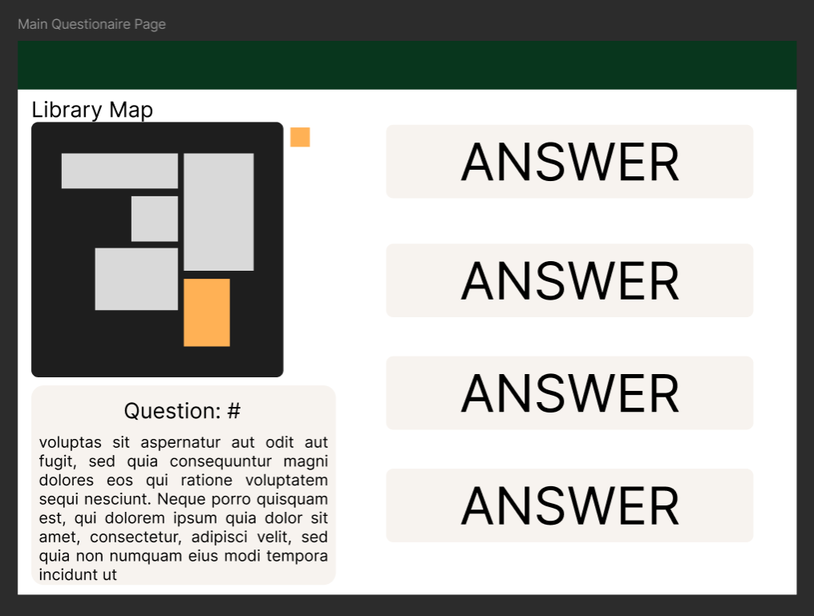

# Development of a Database-Driven Web Application for NCEA Level 3

Project Name: **Library Mystery Room**

Project Author: **Josiah Ching**

Assessment Standards: **91902** and **91903**

-------------------------------------------------

## Design, Development and Testing Log

### 21/06/2024

I am working on a rough sketch up of the main questionnaire page on Figma.

i just did a rough mark up to show the layout of the library map, question text and answer buttons. Will be subject to change as i move forward.

This is how i plan to show what library section the question is themed to, by segregating the library into sections and highlighting the current section that the questions are focused around.

the only user fee back i got was that the colors did not work very well

I planned to change the colors to something more neutral in the future.

### 25/06/24

Simple access/home page for students and admins.

This is a very simple design just 3 squares and 2 lots of text but the only purpose of this page is for the teacher/admin to be able to gain access to the admin properties of the game.

### 27/06/24

Database Diagram.

This is just a quick diagram of how the databases will be setup and how they will communicate with each other. There is a database for all the library areas and each area has many questions attached to it. Each question has many answers attached to it also.

I altered the answers table to carry the answer text as well because i didn't think of this before.

The Database and all the tables have been made and are on the server ready to be used in the website development.

### 6/08/24

Admin login and sign up

.png>)
I started creating a system where the admin or teachers would need a key to create and login into there admin accounts to tweak and modify the game making sure that no student would be able to get in and change the game without permission and a key.

> The system is to complicated and is very clunky to use. A system where you can just simply sign in with a username and password and create an admin account freely but a created account has to be set to to admin status by me through the database or an existing admin.

I ended up changing the whole admin set up by going off the user feedback and using a more simple method. Ive started with changing the sign in form and sign up form.
.png>)

### 07/08/24 & 9/08/24

Admin Sign up

I brought back the creation key and have streamlined it to meet the user feedbacks requirements. I started with making the keys table in the database with a hash field (varchar wit 255 characters).

There is now the admin login form and creation key input together on the admin access page and both are working very well. With the creation key you can access the admin creation page to be able to make an admin account. When a user either makes an account or logs in they are taken back to the welcome page with admin access to the game, this is done through php sessions.

My user said this was a good change to the system so i have kept it how it is and expanded on the system from here.

### 13/08/24

Setting up admin tools

I very quickly updated the home page to show the link for the admin panel and display there information to let the admin know that they are logged in and have access to the future tools to be made.

also added this little block of code around pages related to admin account creation and logging into further secure the feature to make an admin account.

### 15/08/24

Library Introduction and map

i added a quick little introduction blurb and then made and put in the library map which shows all the rooms that are needed to know.

i also added HTMX buttons when clicked show information about the room that they label to further give an explanation about said area

The user sai the introduction blurb was pointless and unnecessary for the website and sad the library map with the HTMX buttons where a much more suited starting page.

Taking the user feedback i deleted te introduction blurb and know when you press get started on the home page the first thing you see is the library map with the information for each room.

### 16/08/24

Finishing admin tools

added the button to access the "admin panel"

created the area where all questions are displayed and you can add answers and set which answer is correct, also delete the whole question if needed

With the question display is also the create new question form where you can enter a title, description and area of the library.

This is the main part of the website on the left is the library map that only displays which room the question is orientated around and below is the question title and description.

To the left is the where the answers go they auto stack and arrange in length and amount of answers. When a user gets it wrong they are displayed a red text reading "wrong answer".

The users feedback was that there was no question number so i added the question number above the library map so that users can identify which question they are up to.

### 23/08/24

HTML validation

for the validation i have had to filter all the HTMX as it throws an error.

The welcome page and admin panel where all validated

### DATE HERE

Replace this test with what you are working on

Replace this text with brief notes describing what you worked on, any decisions you made, any changes to designs, etc. Add screenshots / links to other media to illustrate your notes where necessary.

> Replace this text with any user feedback / comments

Replace this text with notes describing how you acted upon the user feedback: made changes to design, etc.
